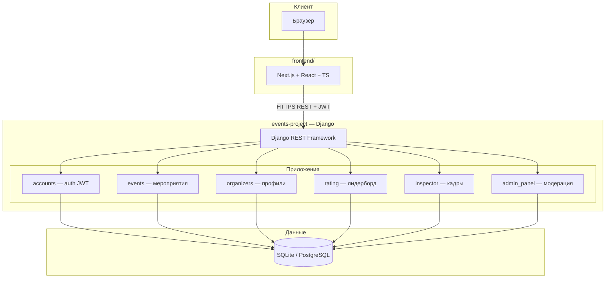

# Razum More Hack

[](https://github.com/viktorgezz/razum-more-hack/actions/workflows/lint.yml)
[](https://github.com/viktorgezz/razum-more-hack/actions)
[](https://github.com/viktorgezz/razum-more-hack/blob/main/events-project/Dockerfile)

[](https://www.python.org/)
[](https://www.djangoproject.com/)
[](https://www.django-rest-framework.org/)
[](https://nextjs.org/)
[](https://react.dev/)
[](https://www.typescriptlang.org/)
[](https://tailwindcss.com/)
[](https://django-rest-framework-simplejwt.readthedocs.io/)
[](https://swagger.io/)

## Описание

Монорепозиторий веб-платформы для учёта активности участников молодёжного парламента и кадрового резерва: мероприятия, прозрачный рейтинг, профили организаторов и участников, инструменты для кадровой службы (инспектор, отчёты PDF) и админ-панель.

**Backend** — Django REST Framework, JWT, OpenAPI (Swagger/ReDoc). **Frontend** — Next.js с обращением к REST API.

## Запуск проекта (Docker)

Самый быстрый способ развернуть весь проект целиком — использовать Docker Compose.

1. **Клонируйте репозиторий:**

   ```bash
   git clone https://github.com/viktorgezz/razum-more-hack.git
   cd razum-more-hack
   ```

2. **Настройте переменные окружения (.env):**

   Скопируйте пример файла конфигурации:

   ```bash
   cp events-project/.env.example events-project/.env
   ```

   *По умолчанию настройки из примера подходят для локального запуска фронтенда (CORS разрешен для `http://localhost:3000`).*

3. **Запустите контейнеры:**

   ```bash
   docker compose up -d --build
   ```

После окончания сборки:

- **Frontend:** <http://localhost:3000>
- **Backend API:** <http://localhost:8000>
- **API Документация (Swagger):** <http://localhost:8000/api/docs/>

## Аккаунты по которым можно зайти и проверить работаспособность

Аккаунты:

- admin/admin123
- org_ivanova/org123
-org_petrov/org123
- участники smirnov_alex
- kozlova_maria / ... все с паролем user123
- наблюдатель observer_hr/obs123.

## Схема проекта



## Инструкция

### Backend (API)

```bash
cd events-project
python -m pip install -r requirements.txt
```

При конфликте истории миграций удалите локальный файл `events-project/db.sqlite3` и выполните `migrate` заново.

```bash
python manage.py migrate
python manage.py runserver
```

### Frontend (опционально)

```bash
cd frontend
npm install
npm run dev
```

### Аутентификация

Защищённые эндпоинты требуют JWT:

- `POST /api/token/` — выдача токенов  
- `POST /api/token/refresh/` — обновление  

Заголовок запросов:

```text
Authorization: Bearer <access_token>
```

### Документация API

| Ресурс | URL (локально) |
|--------|----------------|
| Swagger UI | <http://127.0.0.1:8000/api/docs/> |
| ReDoc | <http://127.0.0.1:8000/api/redoc/> |
| OpenAPI schema | <http://127.0.0.1:8000/api/schema/> |
| Файл схемы | `events-project/openapi.yaml` |

### Проверка кода и тесты (как в CI)

```bash
cd events-project
ruff check . --select E9,F63,F7,F82
python manage.py test
python manage.py check
python manage.py spectacular --file openapi.yaml --validate
```

### Модули backend

| Папка | Назначение |
|-------|------------|
| `accounts` | Регистрация, JWT, профиль |
| `events` | Мероприятия, призы, регистрация, чекин, подтверждение |
| `organizers` | Публичные профили организаторов и отзывы |
| `rating` | Лидерборд, рейтинги, веса баллов |
| `inspector` | Фильтры кандидатов, PDF-отчёты |
| `admin_panel` | Модерация организаторов, веса (через `rating`) |

---

Плашки **Lint** и **Tests** — официальные бейджи workflow; **CI** — общий статус проверок на ветке `main` (shields.io). Плашка **Docker** ведёт на [`events-project/Dockerfile`](events-project/Dockerfile).
